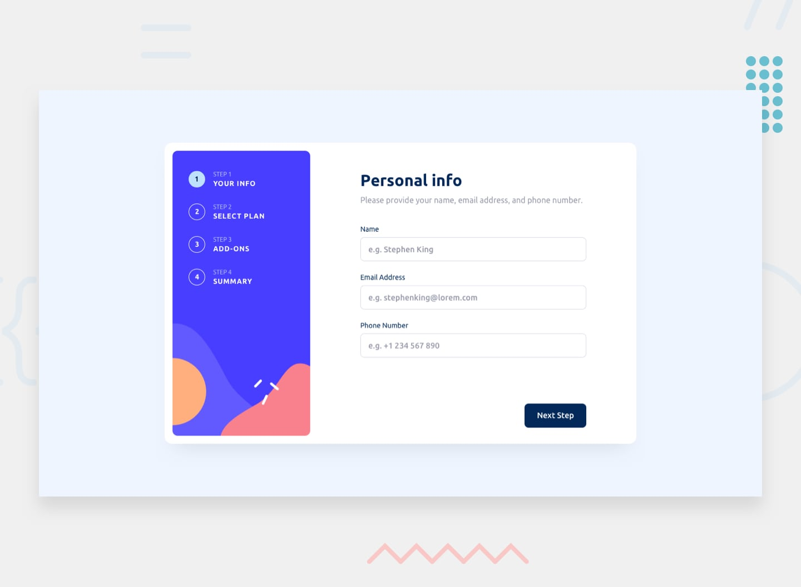
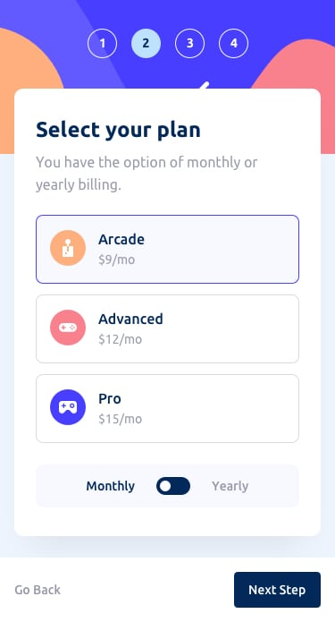
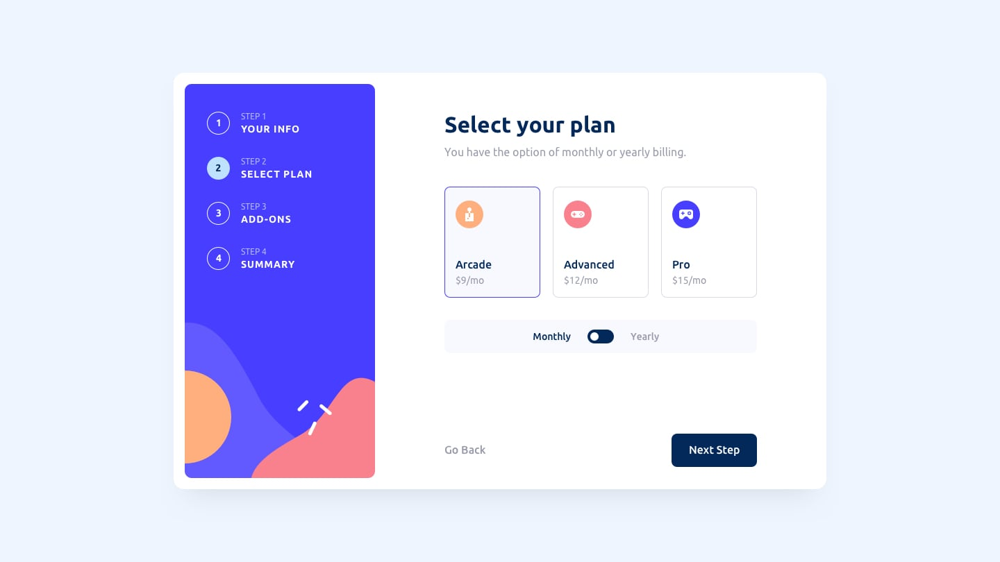
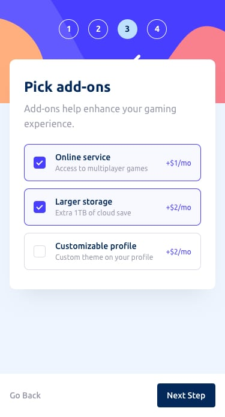
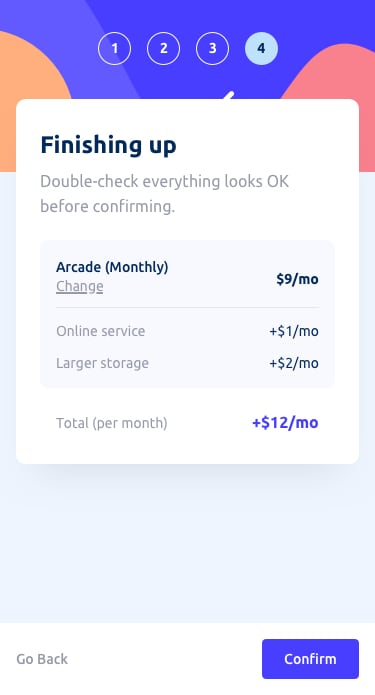
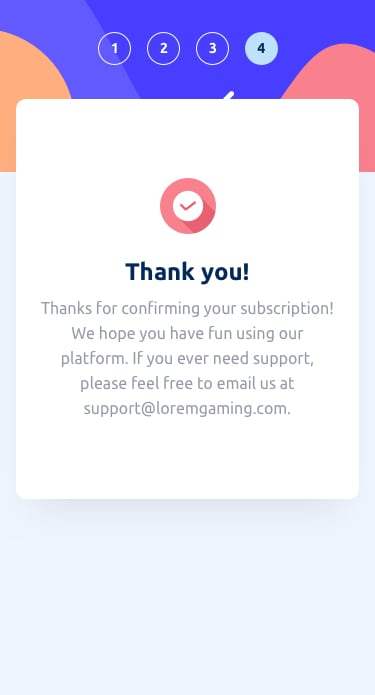

# Multi-Step Form

A modern, responsive multi-step form built with vanilla JavaScript, HTML5, and CSS3. Features smooth animations, form validation, and a beautiful user interface that works seamlessly across all devices.

## Features

### Core Functionality
- **5-Step Form Flow**: Personal Info → Select Plan → Add-ons → Summary → Thank You
- **Smart Navigation**: Step indicators with progress tracking
- **Form Validation**: Real-time validation with helpful error messages
- **Data Persistence**: User data preserved across form steps
- **Responsive Design**: Optimized for mobile, tablet, and desktop

### User Experience
- **Smooth Animations**: Elegant transitions between steps
- **Interactive Elements**: Hover states, focus indicators, and micro-interactions
- **Billing Toggle**: Switch between monthly and yearly pricing
- **Dynamic Pricing**: Real-time price calculations
- **Change Plan**: Easy navigation back to modify selections

### Technical Features
- **Semantic HTML5**: Accessible and well-structured markup
- **Modern CSS**: Flexbox, Grid, and CSS custom properties
- **Vanilla JavaScript**: No frameworks required
- **Mobile-First**: Progressive enhancement approach
- **Cross-Browser Compatible**: Works on all modern browsers

## 📸 Screenshots

### Step 1: Personal Information

### Step 2: Select Plan (Mobile & Desktop)

### Step 3: Add-ons

### Step 4: Summary

### Step 5: Thank You

## 🤝 Contributing

Contributions are welcome! Please feel free to submit a Pull Request. For major changes, please open an issue first to discuss what you would like to change.

## 📄 License

This project is open source and available under the [MIT License](LICENSE).

## 🙏 Acknowledgments

- Design inspiration from modern SaaS onboarding flows
- Color palette and typography guidelines from design systems
- Frontend Mentor for the challenge specification

---

**Built with using vanilla web technologies**
